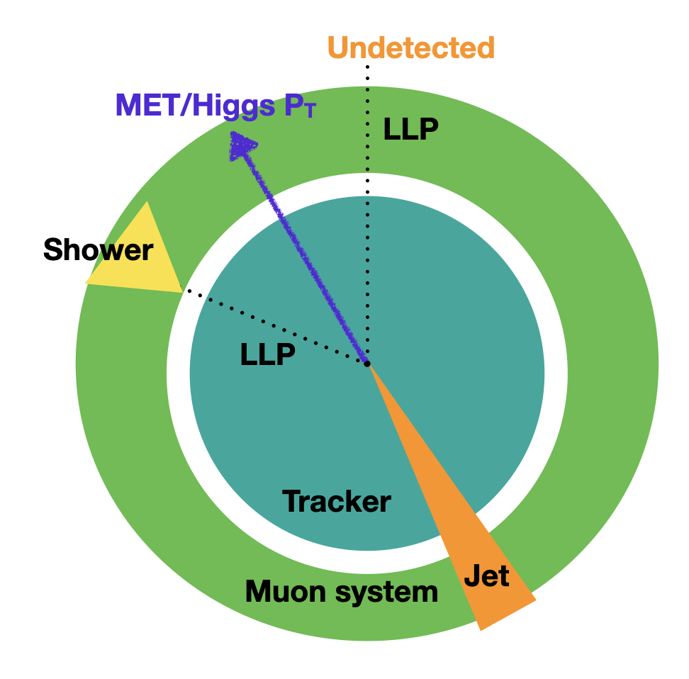

## Benchmark model
The MDS signature is model independent, but to develop an analysis strategy we use the higgs portal as a benchmark model, where the Feynman diagram shown below.
We choose this model because its one of the more difficult model probe at the LHC, with no stable BSM particles to produce large MET and the final state objects from the higgs are generally low pT, and additionally this model is used commonly across many CMS physics searches for sensitivity comparison

> ## Figure 4.1
> 
> Feynman diagram of the higgs portal model, where a pair of LLPs (S) are produced from the Higgs and the LLPs can decay to fermions.
{: .callout}

## Trigger strategy and event-level selections

As mentioned in the introductory slides, there's no dedicated trigger for this signature in Run2.
For the Run2 search, we use the MET trigger, which has a 1% signal efficiency for higgs portal signals.
For the signal event, when one LLP decays in the muon detector, for LLP $c\tau\sim 1$, in most cases the second LLP also decays outside of the calorimeter, so the MET is highly correlated with the higgs pT, as seen in Figure 1.2
Therefore, when we require a high MET in the signal event, we are selecting for a boosted Higgs phase space.

> ## Figure 4.2
> 
> Diagram demonstrating the signal topology.
{: .callout}

The event selections for this search are kept at minimal to be as model independent as possible.
We only apply the MET trigger and an offline MET cut of 200 GeV, due to the use of the high-MET skim dataset.

To select for a signal-like cluster from an LLP, we will investigate a number of variables that are used in the analysis that remove punch-through jet and muon brem background in the following sections.

## Cluster-level selections

> ## Open a notebook
>
> For this part, open the notebook called `analysis_strategy.ipynb` and run `Ex0` to load the ntuples, apply event level selections, and load the relevant branches.
{: .checklist}

At the cluster-level, we don't apply any selections for data, while for signal we select clusters that are matched to generator-level LLPs that decay in the muon detectors.
At the event-level, we only apply the MET trigger, offline MET cut, and the required MET filters that are already encoded in the `metFilters` variable.

### Punch-through Jet and Muon Bremsstrahlung Background

The dominant background from the main collision comes from punch-through jets that are not fully contained in the calorimeters and high pT muons that could create bremsstrahlung showers in the muon detectors. To remove those background, we reject clusters by matching them to reconstructed jets and muon.
The pT of the jet/muon that the cluster is matched to are saved in objects called `cscRechitClusterJetVetoPt` and `cscRechitClusterMuonVetoPt`.
In this exercise you will plot the two variables for signal and background and apply a selection on the two variables to remove clusters from jets and muons.

> ## Open a notebook
>
> For this part, open the notebook called `analysis_strategy.ipynb` and run `Ex1` to plot the two variables `cscRechitClusterJetVetoPt` and `cscRechitClusterMuonVetoPt`.
{: .checklist}

> ## Discussion 4.1
>
> Does the shape make sense to you? Why does signal has small values and background has larger values? The analysis apply a cut of `cscRechitClusterJetVetoPt<10` and `cscRechitClusterMuonVetoPt<20`, do you agree with these selections?
{: .discussion}

### Cluster Hits in ME11 and ME12

Additionally, punch-through jets or muon bremsstrahlung showers might not get reconstructed as jets and muons.
To fully remove these background, we remove clusters that have hits in the first CSC stations (ME11/ME12) that have little shielding in front.

In this exercise you will plot the number of ME11/ME12 hits in clusters for signal and background and apply a selection on the two variables to remove clusters from jets and muons.

> ## Open a notebook
>
> For this part, open the notebook called `analysis_strategy.ipynb` and run `Ex2` to plot the number of ME11/ME12 hits in clusters
{: .checklist}

> ## Discussion 4.2
>
> Does the shape make sense to you? Why does signal has small values and background has larger values? The analysis requires clusters to have no hits in ME11 and ME12, does you agree with the selection?
> 
{: .discussion}

### Cluster $\eta$ 

After we removed punch-through jets and muon brems, we observed that there are a lot more backgorund in higer $\eta$ region, where the muon reconstruction efficiency is lower and more pileup particles are present to create clusters.

In this exercise you will plot the cluster $\eta$ for signal and background and apply a selection on the variable to remove clusters from high $\eta$ region.

> ## Open a notebook
>
> For this part, open the notebook called `analysis_strategy.ipynb` and run `Ex3` to plot the cluster $\|\eta\|$.
{: .checklist}

> ## Discussion 4.3
>
> Does the shape make sense to you? The analysis requires clusters to have $ \| \eta \| < 2$, does you agree with the selection?
> 
{: .discussion}

### Cluster time

The remaining background clusters after punch-through jet and muon brem showers from the main collision are removed, are from low pT particles in pileup events.
To verify this, you will plot the cluster time for signal and background in this exercise to check for any out-of-time pileup contributions in data.

> ## Open a notebook
>
> For this part, open the notebook called `analysis_strategy.ipynb` and run `Ex4` to plot the cluster time.
{: .checklist}

> ## Discussion 4.4
>
> Does the shape make sense to you? Why is data spaced at 25 ns?
> 
{: .discussion}

In the analysis, we apply a selection requiring the cluster time to be between -5 ns and -12.5 ns as the signal region.
Additionally, to make use of the out-of-time background clusters, we define a background-enriched early out-of-time (OOT) validation region for the background estimation method used for this analysis, which we will go through in the next episode.

### Cluster $N_{\text{hits}}$ and $\Delta\phi\text{(cluster, MET)}$

The final discriminating variables that we will use to extract the signal and estimate background are the number of hits in the cluster ($N_{\text{hits}}$) and the azimuthal angle between the cluster and MET ( $\Delta\phi\text{(cluster, MET)}$).
The background estimation method will be described in more detail in the next episode.
In this exercise, we will just plot the distributions of the two variables, to understand the shape of the two variables.

> ## Open a notebook
>
> For this part, open the notebook called `analysis_strategy.ipynb` and run `Ex5` to plot the two variables.
{: .checklist}

> ## Question 4.1
>
> Why does the $\Delta\phi\text{(cluster, MET)}$ peak at 0 for signal, but flat for background distribution?
{: .challenge}

> ## Solution 4.1
> For signal, the cluster corresponds to the LLP direction and MET corresponds to the higgs direction, so the two objects are aligned as you can see from Figure 4.2.
> For background, clusters are produced from underlying events, while MET is calculated from primary event, so the two objects are independent.
> Additionally, since $\Delta\phi\text{(cluster, MET)}$ is flat for background, it is also independent to $N_{\text{hits}}$, which is a key property that we will make use of in the next episode to develop the background estimation method.
{: .solution}

> ## Discussion 4.6
>
> In the analysis, we apply a selection requiring the $N_{\text{hits}}>130$ and  $\| \Delta\phi\text{(cluster, MET)}\| < 0.75$. Do you agree with the selections?
> 
{: .discussion}

Now we have defined the set of selections to select signal clusters, next we will go over how to estimate the background yield with a fully data-driven method without using MC simulation.



