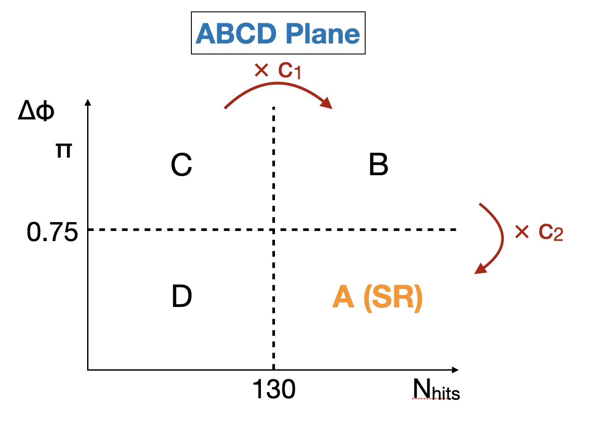

## ABCD method

As you've seen in the previous exercise, the main background is from clusters produced in pilup interactions.
To estimate the background, we use a fully data-driven background estimation method, the ABCD method, that make use of two independent variables for the background: $N_{\text{hits}}$ and $\Delta\phi\text{(cluster, MET)}$.

The ABCD plane is illustrated in Figure 5.1, where bin A is the signal-enhanced region, with large values of $N_{\text{hits}}$ and small values of $\Delta\phi\text{(cluster, MET)}$.
The estimation of the number of events in each bin is expressed by:

$$\\

\begin{align}
N_A &= c_1\times c_2 \times Bkg_C +\mu \times SigA\\
N_B &= c_1\times Bkg_C +\mu \times SigB\\
N_C &= Bkg_C +\mu \times SigC\\
N_D &= c_2\times Bkg_C +\mu \times SigD\\
\end{align}

\\$$

\begin{align}
N_A &= c_1\times c_2 \times Bkg_C +\mu \times SigA\\
N_B &= c_1\times Bkg_C +\mu \times SigB\\
N_C &= Bkg_C +\mu \times SigC\\
N_D &= c_2\times Bkg_C +\mu \times SigD\\
\end{align}

$
\begin{align}
N_A &= c_1\times c_2 \times Bkg_C +\mu \times SigA\\
N_B &= c_1\times Bkg_C +\mu \times SigB\\
N_C &= Bkg_C +\mu \times SigC\\
N_D &= c_2\times Bkg_C +\mu \times SigD\\
\end{align}
$

where:
* SigA, SigB, SigC, SigD are the number of signal events expected in bin A, B, C, and D, taken from the signal MC prediction.
* $\mu$ is the signal strength (the model parameter of interest)
* $c_1$ is the ratio between background in B and C; $c_2$ is the ratio between background in D and C; Both c1 and c2 are essentially interpreted as nuisance parameters that are unconstrained in the fit.
* BkgC is the number of background events in bin C

> ## Figure 5.1
> 
> Diagram of the ABCD plane, where bin A is the signal region, $c_1$ is the ratio between background in B and C, and $c_2$ is the ratio between background in D and C.
{: .callout}

## Validation of the ABCD method

We have shown the previous episode that if the background clusters are from pileup interaction than the two variables $N_{\text{hits}}$ and $\Delta\phi\text{(cluster, MET)}$ should be independent of each other.
To validate this assumption and the only background sources are from pileup interactions, we create two validation region that are enriched with background and perform ABCD method to check that the prediction from ABCD matches with the observation.

> ## Open a notebook
>
> For this part, open the notebook called `ABCD_validation.ipynb` and define the OOT control region and perform the validation test for various thresholds.
{: .checklist}



