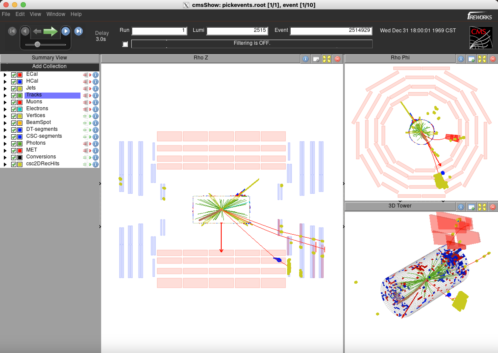

In this episode you will create event display of signal simulation events that enter the signal region.

## Find and pick events you want to view

We will first find the events that we want to view, by saving the run number, lumi section, and event number of the events.
> ## Open a notebook
>
> For this part, open the notebook called `event_display.ipynb`.
> This note book is very similar to the notebook in the previous episode, where we make the signal region selection and save the run number, lumi section, and event number of the events that we want to view in a text file.
{: .checklist}

create text file of event number from selection
Now run the following code that will pick the ROOT files in the dataset that contain the events that you want based on the run/lumi/event numbers that you supplied:
~~~
edmPickEvents.py  "/ggH_HToSSTobbbb_MH-125_TuneCP5_13TeV-powheg-pythia8/RunIIFall17DRPremix-PU2017_rp_94X_mc2017_realistic_v11-v1/GEN-SIM-RECO” event_display.txt
~~~
{: .language-bash}

This command will print a command on the screen, like the following, copy and run it in the terminal:

~~~
edmCopyPickMerge outputFile=pickevents.root \
  eventsToProcess=1:10122482,1:1055072,1:1055666,1:1127224,1:12138657,1:1441939,1:1441963,1:2514929,1:2896338,1:4255433 \
  inputFiles=/store/mc/RunIIFall17DRPremix/ggH_HToSSTobbbb_MH-125_TuneCP5_13TeV-powheg-pythia8/GEN-SIM-RECO/PU2017_rp_94X_mc2017_realistic_v11-v1/130001/B2A708EC-0D4E-EA11-8B93-0025905C2CBC.root,/store/mc/RunIIFall17DRPremix/ggH_HToSSTobbbb_MH-125_TuneCP5_13TeV-powheg-pythia8/GEN-SIM-RECO/PU2017_rp_94X_mc2017_realistic_v11-v1/130001/84696409-FC4D-EA11-A8CD-0CC47AFF0190.root,/store/mc/RunIIFall17DRPremix/ggH_HToSSTobbbb_MH-125_TuneCP5_13TeV-powheg-pythia8/GEN-SIM-RECO/PU2017_rp_94X_mc2017_realistic_v11-v1/130000/349A8AB2-BF4D-EA11-9AFF-00259073E43C.root,/store/mc/RunIIFall17DRPremix/ggH_HToSSTobbbb_MH-125_TuneCP5_13TeV-powheg-pythia8/GEN-SIM-RECO/PU2017_rp_94X_mc2017_realistic_v11-v1/130001/A4F52ADD-C94D-EA11-B339-7CD30AD091F0.root,/store/mc/RunIIFall17DRPremix/ggH_HToSSTobbbb_MH-125_TuneCP5_13TeV-powheg-pythia8/GEN-SIM-RECO/PU2017_rp_94X_mc2017_realistic_v11-v1/130000/04DB0102-BB4D-EA11-A197-7CD30AD0A78C.root,/store/mc/RunIIFall17DRPremix/ggH_HToSSTobbbb_MH-125_TuneCP5_13TeV-powheg-pythia8/GEN-SIM-RECO/PU2017_rp_94X_mc2017_realistic_v11-v1/130000/D6C63C14-484C-EA11-B04A-1866DA85DC8B.root,/store/mc/RunIIFall17DRPremix/ggH_HToSSTobbbb_MH-125_TuneCP5_13TeV-powheg-pythia8/GEN-SIM-RECO/PU2017_rp_94X_mc2017_realistic_v11-v1/130001/4A6C137D-CA4D-EA11-B475-001E67E7195C.root,/store/mc/RunIIFall17DRPremix/ggH_HToSSTobbbb_MH-125_TuneCP5_13TeV-powheg-pythia8/GEN-SIM-RECO/PU2017_rp_94X_mc2017_realistic_v11-v1/130001/DAD03CA8-624E-EA11-A67F-0242AC1C0504.root
 ~~~
 {: .language-bash}

Depending on how many events you've chosen, the process might long, don't choose more than 10 events!
Now you have a ROOT file called `pickevents.root` that contains the RECO format of the events you have chosen.

## Open the events with cmsShow

Run the followin commands to install and run cmsShow:
~~~
${CMSSW_BASE}/src/MDS_CMSDAS2023/event_display
wget https://cmsshow-rels.web.cern.ch/cmsShow-rels/cmsShow-12.1.tgz
tar xzf cmsShow-12.1.tgz
cd cmsShow-12.1

# now run cmsShow with pickevents.root
./cmsShow ../pickevents.root --no-version-check
~~~
 {: .language-bash}

You will now see a graphical interface like this:
By default the `csc2DRecHits` are not included in the display, go to Add Collection on the left to add the rechits collections!
Now you can skim through the events that you have selected to see if the clusters appear as you've expected.

> ## Figure 5.1
> 
> Event display of a signal event from cmsShow.
{: .callout}



